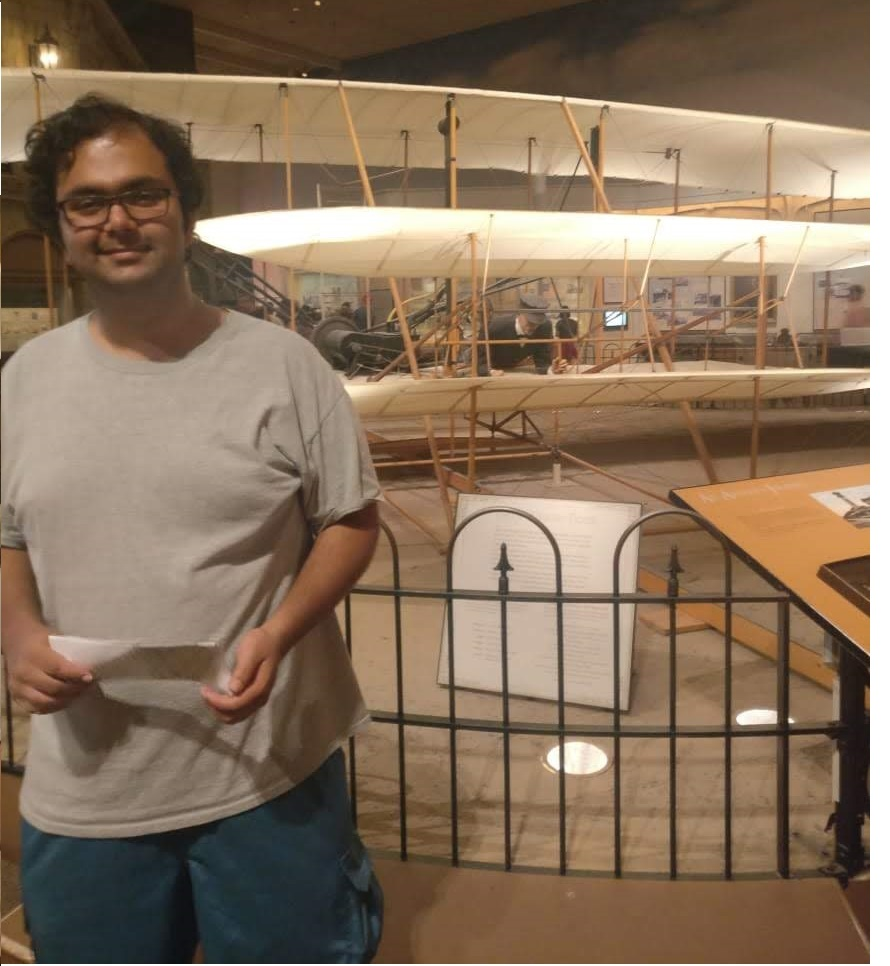
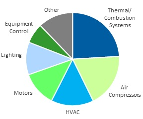

---
## About Me

I am a mechanical engineer currently researching thermal energy storage systems. This allows me to work on the exciting confluence of the fields of fluid mechanics, heat transfer, turbulence, computational fluid dynamics(CFD), experiments in fluids and energy. I am now pursuing a PhD at the University of Massachusetts Amherst. My previous research includes Direct numerical simulations(DNS) of turbulent flows and heat transfer enhancement in fluidized beds and cyclone separators. I enjoy studying mathematics as a pleasant diversion. As part of the Industrial Assessment Center, I also visit industrial facilities in New England and reccomend energy efficiency measures. I have completed over 30 visits, and implemented reccomendations from my visits have saved customers over $1,150,852.00 annually.

## Work Experience

### Research Assistant at [Center for Energy Efficiency and Renewable Energy](http://www.ceere.org/iac.html).
I study Latent Heat Thermal Energy Storage Systems(LHTES), with a focus on creating physics infused performance correaltions (rather than arbitrary data based curve fit) for LHTES devices. I conduct combined numerical and experimental studies to support my hypotheses.
 
<video controls>
  <source src="./plots/video-meltingofphasechangematerial.mp4" type="video/mp4">
Your browser does not support the video tag.
</video>

### Energy Engineer

As the lead Energy Engineer at the Industrial Assessment Center, I have conducted over 30 energy assessments and saved customers over $1,150,852.00 anually. A split up of implemented reccomendations is shown, taken from
 
[http://www.ceere.org/iac.html](http://www.ceere.org/iac.html).

    

## Research