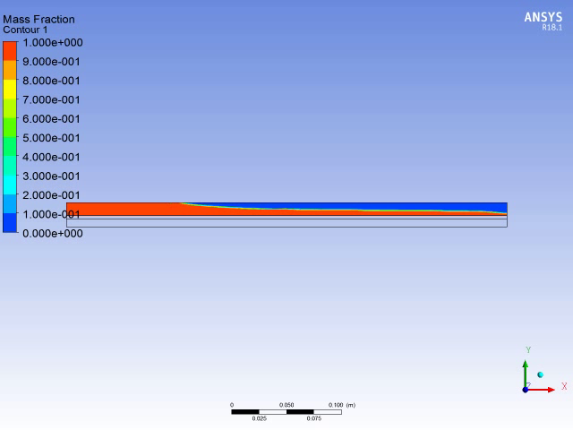
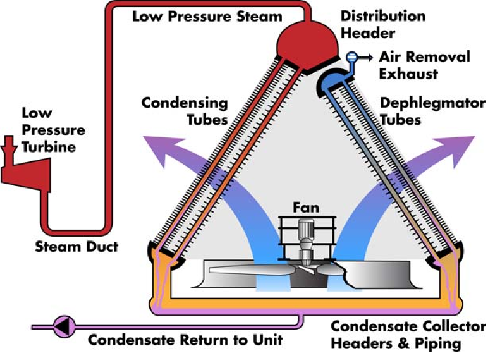
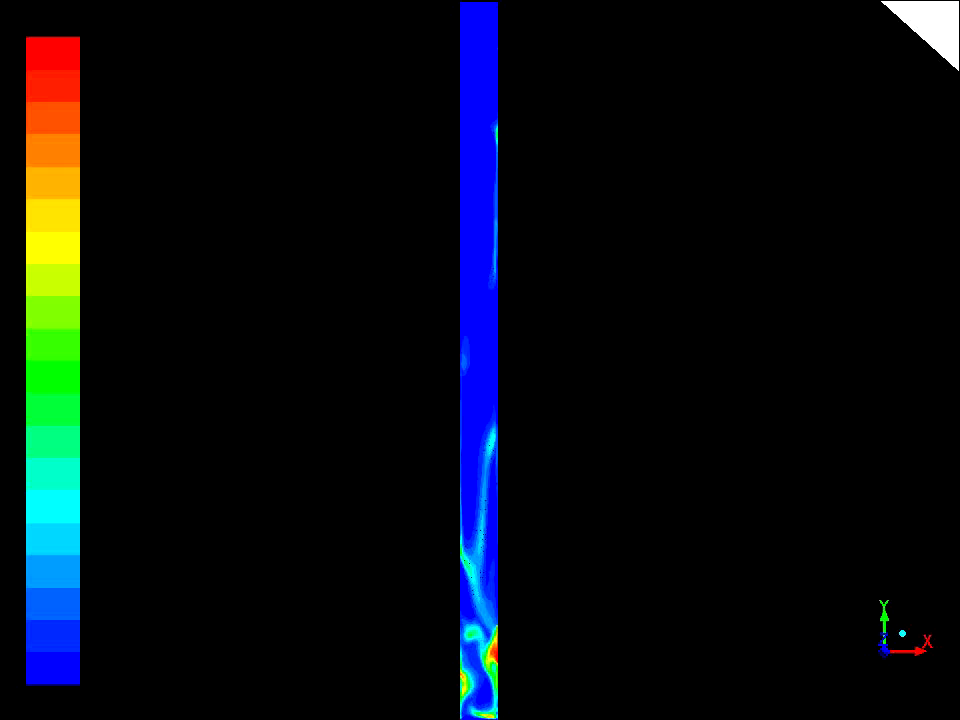
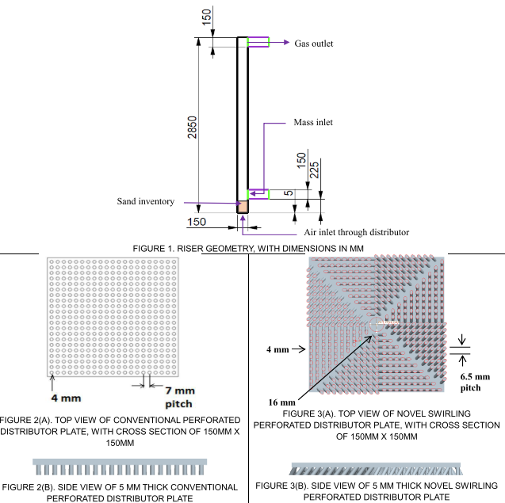
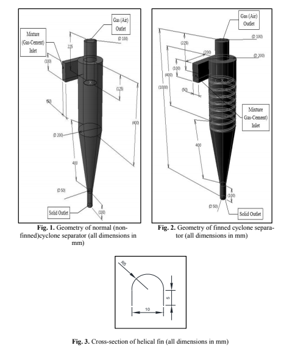

---
## About Me

 <b>
I am a mechanical engineer currently researching thermal energy storage systems. This allows me to work on the exciting confluence of the fields of fluid mechanics, heat transfer, turbulence, computational fluid dynamics(CFD), experiments in fluids and energy. I am now pursuing a PhD at the University of Massachusetts Amherst. My previous research includes Direct numerical simulations(DNS) of turbulent flows and heat transfer enhancement in fluidized beds and cyclone separators. I enjoy studying mathematics as a pleasant diversion. As part of the Industrial Assessment Center, I also visit industrial facilities in New England and recommend energy efficiency measures. I have completed over 30 visits, and implemented recommendations from my visits have saved customers over $1 million annually. For more information, please email  me at <a href = "mailto: kedar.kshete@gmail.com">kedar.kshete@gmail.com</a>.</b> 

 

## Places I have worked

### Research Assistant at [Center for Energy Efficiency and Renewable Energy](http://ceere.org/research.html) Sep 2019 to present
<figure style="max-width: 50%;height: auto;float: left;">
<video controls style="width: 100%;height: auto;">
  <source src="./plots/video-meltingofphasechangematerial.mp4" type="video/mp4">

</video>
<figcaption >The video shows the melting of Phase Change Material(PCM) in an LHTES shell and tube device. This is simulated using the Finite Volume Method(FVM) in ANSYS Fluent.</figcaption>
</figure>
I study Latent Heat Thermal Energy Storage Systems(LHTES), with a focus on creating physics infused performance correlations (inspired by flow physics rather than curve fit) for LHTES devices. I conduct combined numerical and experimental studies to support my hypotheses. Our research will help reduce electric demand when used in conjunction with combined heat and power plants. It shall also be used to integrate renewable energy sources like solar thermal with the grid. Our basic fluids research(conducted as part of this project) will improve our understanding of turbulent natural convection. 
For our project proposal entitled ***"Design of Latent Thermal Energy Storage Heat Exchangers for Combined Heat and Power Plants"***, me and my collaborators Prof. Dragoljub (Beka) Kosanovic and Prof. Steve de Bruyn Kops were awarded the **[Industrial Assessment Center (IAC) Award for Excellence in Applied Energy Engineering Research 2020](https://iac.university/studentResearchAwards)** ! Thanks to Beka and Steve for guiding me in writing this proposal.
 

### Research Assistant at [Turbulence Simulation Laboratory](https://people.umass.edu/debk/) Oct 2016 to Dec 2018
<figure style="max-width: 50%;height: auto;float: left;">

<figcaption> The image shows isosurfaces of a passive scalar twisted by the high Reynolds number turbulent flow. Isosurfaces of the scalar represent area available for mixing/reaction, increased areas result in enhanced mixing and reaction rates, making their study important. </figcaption>
</figure>
I studied turbulence and mixing using Direct Numerical Simulations (DNS). The mixing of scalars(such as temperature or chemicals) due to fluid turbulence is an important problem for modeling combustion, turbulent jets and geophysical flows. This fundamental research connects well to my LHTES research because heat transfer in LHTES devices is dominated by turbulent convection in the PCM. 
Our results from this research are published in the **[Journal of Fluid Mechanics](https://www.cambridge.org/core/journals/journal-of-fluid-mechanics)** as ***[Area of scalar isosurfaces in homogeneous isotropic turbulence as a function of Reynolds and Schmidt numbers](https://doi.org/10.1017/jfm.2019.875)*** and as my Master of Science thesis entitled [Calculation of Scalar Isosurface Area and Applications](https://scholarworks.umass.edu/masters_theses_2/854). Thanks to Steve and Gavin for help and comments ! 
 

### Energy Engineer at the [Industrial Assessment Center](http://www.ceere.org/iac.html) (IAC) Sep 2017 to present
<figure style="max-width: 90%;height: auto;float: left;">

<figcaption> A split up of implemented recommendations.</figcaption>
</figure>
As the lead Energy Engineer at the Industrial Assessment Center, I have conducted over 30 energy assessments and saved customers over 8.9 million MMBTU's equivalent of energy and $1,021,241 annually, metrics are available [here](./IAC_metrics_3439_20200910.xlsx), taken from the IAC portal. I have experience with conducting assessments independently, training new students and mentoring. 
 

### Senior Engineer at [Thermax Ltd.](https://www.thermaxglobal.com/) Mar 2016 to July 2016
<figure style="max-width: 40%;height: auto;float: left;">
	
<figcaption> A schematic of an Air Cooled Condenser is shown, taken from <em>Dooley, R. Barry, et al. EPRI's Guideline on Chemistry for Fossil Units with Air-cooled Condensers (ACCs). EPRI, 2009.</em></figcaption>
</figure>
As senior engineer, I designed Air Cooled Condensers using the heat transfer software [HTRI](https://www.htri.net/) and validate by design procedure against experimental data for 50 existing Air Cooled Condensers across the world(provided by Thermax SPX). Our project was focused on predicting heat transfer rates for tubes at various inclinations, fin pitch and length, which is a two phase turbulent heat transfer problem, making it tough to study numerically. We thus approached it using standard correlations available in literature and HTRI, and tuned our formulation to match experimental results provided by Thermax SPX.  
 

### Application Engineer at [SKF Ltd.](https://www.skf.com/in) Jun 2014 to Sep 2015
<figure style="width: 40%;height: auto;float: left;">  </figure>
As Application Engineer at SKF India Ltd, I worked for 6 months in the after market business, where I designed bearing systems for the after market customers. After a period of 6 months, I was promoted to the OEM division, where I designed bearing and lubrication systems for manufacturers of crushers, vibrating screens, conveyors, motor and pump systems, transmission boxes, gearboxes, etc. The certificate shows an achievement award for a project I lead, entitled *"Improvement in energy efficiency of Ring Frame Spinning Machines at Arvind Mills, 2014"*.
 

### Undergraduate Researcher at [BITS Pilani KK Birla Goa Campus](https://universe.bits-pilani.ac.in/goa/ranjitp/profile) Jan 2014 to Aug 2014
<figure style="float: left;width: 50%;height: auto;">
<video controls style="width: 100%;height: auto;">
  <source src="./plots/fluidized_bed.mp4" type="video/mp4">
  
</video>
<figcaption>Simulation of flow in fluidized bed riser with mass inlet. The granular solid phase is tossed around by the fluid entering from the base of the riser. Additional granular material comes in through the inlet. In a Circulating Fluidized Bed(CFB) boiler, the granular phase would be coal or powdered biomass, and the returning mass inlet would be unburnt fuel separated from the exhaust by the cyclone separator(not in figure). This feature makes CFB boilers more efficient than their counterparts.</figcaption>
</figure>
I increased the mixing and combustion efficiency in Circulating Fluidized Bed(CFB) risers using novel distributor plate designs. Circulating Fluidized Bed risers have applications in high efficiency boilers, gasifiers, combustors, dryers, power coating etc. When used as a boiler, they are accompanied by cyclone separators (to remove particulate matter prior to exhaust). Cyclone separators also have applications in the cement industry, waste water treatment, boilers technology and even vacuum cleaners. I also proposed alternative cyclone separator designs to enable heat extraction from cyclone separators, using internal fins. Our results were published as [Effect of Novel Swirling Perforated Distributor on Fluid Dynamic Characteristics of Circulating Fluidized Bed Riser](https://doi.org/10.1115/POWER2016-59165) and two conference papers at [5th International Conference on Fluid Mechanics and Fluid Power (FMFP 2014)](./FMFP_Merged_Papers.pdf)
 
<figure>
	
	
	<figcaption>Novel design of distributor plates enhance mixing in CFB risers(left). Fins on cyclone separator enable heat extraction(right).</figcaption>
</figure>	
 

